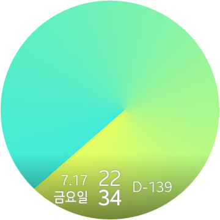

# tizen-random-bg-watchface-demo

This is a web-based demo watchface for smartwatches running Tizen 4.0 or higher, based on the `DigitalWatch` sample included in Tizen Studio. 
Features included in the project are random image shuffling and support for countdown in days(hard-coded in `app.js`).
## Guide
### js/app.js
`BACKGROUND_URL`: Array of images to be chosen as background(Changes on every wakeup or when background is touched). 
`arrDay`: Array of weekdays(Sun, Mon, ..., Sat). 
`arrMonth`: Array of months(Jan, Feb, ..., Dec). 
`satDate`(YYYY-MM-DD): You can set a countdown in days for whichever event you like.  
`changeBG()`: Loaded when the background is touched(`document.body.addEventListener("click", changeBG);`) or when watchface is initialized. In such situations, one of the images in `BACKGROUNDS_URL` is randomly selected and set as the background image for your watch.
### images/bg*.jpg
You can set whichever image you prefer. You can also change `BACKGROUND_URL` and `changeBG()` in `js/app.js` to add/change/remove the path of the images to set as background(s).
### index.html
sets the basic layout of your watchface. `rec-string-time` displays date and weekday, and `rec-string-time2` displays days until `satDate`.
### style.css
is the stylesheet for `index.html`.
